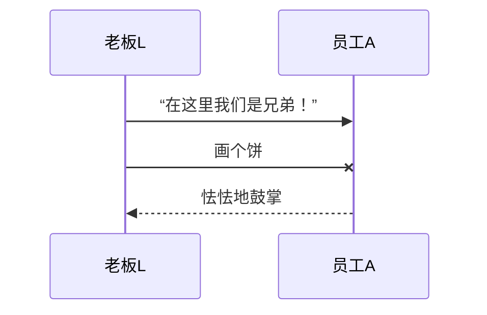

## Hey

> 这是我的第一篇博客。

```python
print("Hello World!")
print("Hello Blog!")
```

Hello Blog!

使用KaTeX渲染公式：

$$
E=mc^2
$$

使用 Mermaid语法画时序图：


```mermaid
sequenceDiagram
    participant 老板L
    participant 员工A

    老板L ->> 员工A : “在这里我们是兄弟！”
    老板L -x 员工A : 画个饼
    员工A -->> 老板L : 怯怯地鼓掌
```

图片：


